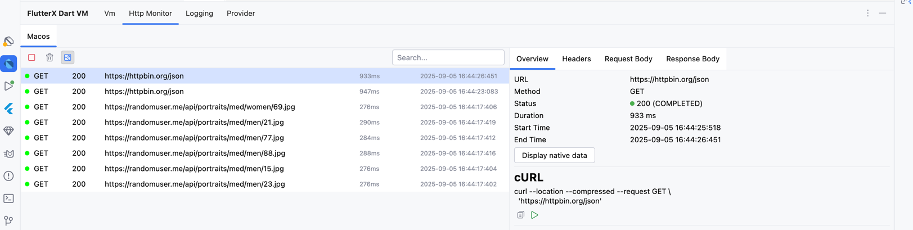
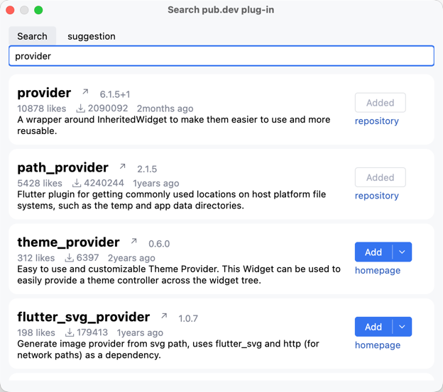
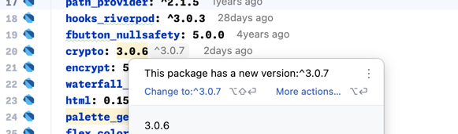
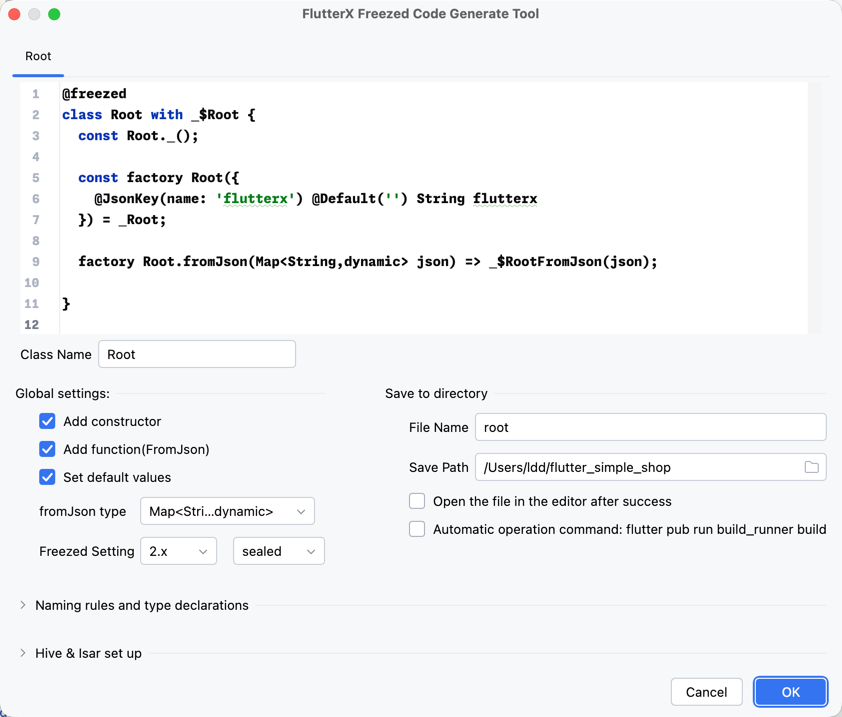
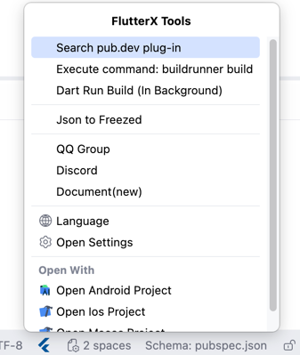
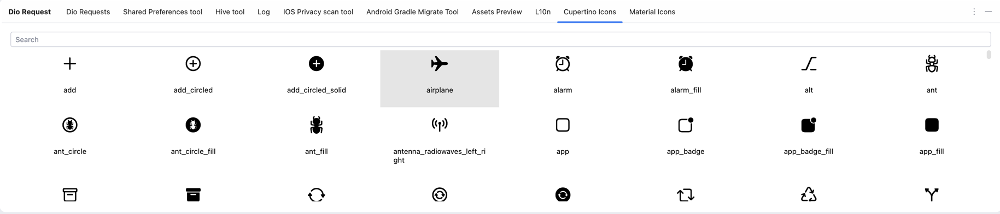

<div style="text-align: center;">
<h1>FlutterX</h1>
</div>

<div style="text-align: center;">
    <a href="https://mdddj.github.io/flutterx-doc">📄Document</a>
    <span>·</span>
    <a href="https://plugins.jetbrains.com/plugin/18986-fluttercheckversionx">🔗Download</a>
</div>

Flutter development assistant, Dio monitoring, variable type display, generation of asset file dictionary,
beautification of Dart documents and other tools, documents are under preparation

- [x] Dart document beautification
- [x] Flutter plug-in version detection update
- [x] Flutter plug-in jumps to pub.dev shortcut
- [x] Pubspec.yaml searches for packages and supports one-click import
- [x] Dio request listening window, quickly view http requests
- [x] Flutter plug-in historical version prompt
- [x] Dart attribute inline prompt (final,val,const)
- [x] Asset Generation Dictionary

More tools in development...

## Sponsor

Thanks to **JETBRAINS** for the free open source license

<a href='https://www.jetbrains.com'></a>

## Screenshot

| http Monitor                                                   | Search Package                                     | Update Package                       |
|----------------------------------------------------------------|----------------------------------------------------|--------------------------------------|
|   |                     |   |
| Json2Freezed                                                   | Status Bar                                         | Icon Table                           |
|  |  |  |

More than 100+ flutter auxiliary tools...


# act 本地测试 GitHub action

```bash
act -j build-and-release -s GITHUB_TOKEN=github token --env GITHUB_REF=refs/tags/v版本号
```